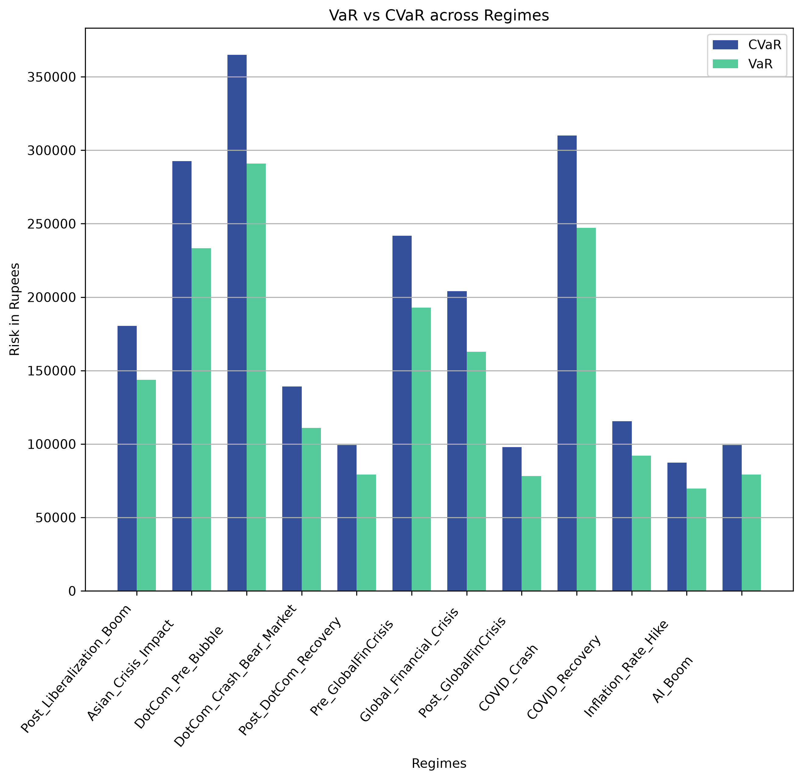

# Expected Shortfall and Value-at-Risk Analysis across Market Regimes


Financial markets do not behave the same way at all times. The periods of calm are interrupted  by crises, recoveries, and changes in volatility. A risk model that is calibrated on a single, static window of data can therefore be dangerously misleading, it may understate risk in a crisis regime or overstate it in a stable regime.

This project quantifies portfolio downside risk using **Value at Risk (VaR)** and **Conditional Value at Risk (CVaR)** through variance-covariance method, and repeats the calculation across **12 distinct historical regimes of the Indian equity market (1996–2025)**. This lets the risk measures be compared regime-by-regime instead of relying on one consolidated data, this is my attempt of building it closer to how risk is actually assessed under regulatory stress-testing frameworks.

---

## Objectives

* **Develop a portfolio risk model** that calculates both **Value at Risk (VaR)** and **Conditional Value at Risk (CVaR)** at a given *confidence level*, identifying the portfolio’s loss threshold and measuring the **average loss in the tail beyond that threshold**.

* **Conduct a multi-regime risk analysis** over the **1996–2025** period by dividing the Indian market into **12 historically significant regimes**, including major crises and recovery periods, to assess how the **same portfolio’s losses and tail risk vary across different market conditions**.


---

## What is VaR?


**Value at Risk (VaR)** is the maximum expected loss on a portfolio, over a given time horizon, at a given confidence level, under normal market conditions.

> A 1-day VaR of ₹50,000 at 95% confidence means there is only a 5% chance the portfolio loses more than ₹50,000 in a single day.


---

## What is CVaR?

**Conditional Value at Risk (CVaR)** is the *expected loss given that the loss has already exceeded the VaR threshold*.

While VaR tells you the loss at the boundary of the worst-case region, CVaR tells you the *average loss inside that worst-case region* — making it a more conservative, tail-sensitive risk measure.

---


## Formula

**A) Portfolio volatility :**

```
σ = sqrt( wᵀ · Σ · w )
```
where, `w` = portfolio weight vector,
      `Σ` = annualized covariance matrix of log returns 
      
As per NSE data, there are only  *248 trading days* in Indian Stock Markets.

**B) VaR | Value-at-Risk :**

```
VaR = Portfolio_Value × σ × z(cl) × sqrt(d / 248)
```

**C) CVaR | Expected Shortfall :**

```
CVaR = Portfolio_Value × σ × [ φ(z) / (1 − cl) ] × sqrt(d / 248)
```

Where:
- `z(cl)` = Z score at given `cl`
- `φ(z)` = standard normal probability density function(pdf) at `z`
- `d` = holding period in days (x-day horizon)
- `248` = no. of trading days in a year

---

## Tools and Libraries Used

| Tool / Library | Purpose |
|---|---|
| `Python 3` | Core language |
| `pandas` | Data handling, DataFrames for prices, returns, and results |
| `numpy` | Matrix/vector math (covariance, weights, log returns) |
| `yfinance` | Downloading historical NSE stock price data |
| `scipy.stats.norm` | Normal distribution functions (`ppf`, `pdf`) for VaR/CVaR |
| `matplotlib` | Bar chart (VaR vs CVaR) and per-regime return histograms |
| `datetime` | Regime date-range parsing |

---

## User Interactive

The code is interactive at runtime and prompts the user for the following inputs:

| Input | Description |
|---|---|
| Portfolio value (₹) | Total capital allocated to the portfolio |
| Confidence level | Confidence level for VaR/CVaR (as a decimal) |
| Time window (days) | Holding period / x-day horizon |
| Weight distribution method |Equal weights for all or Manually enter |
| Per-stock weight *(if option b)* | Weight for each of the tickers |


---

## VaR vs CVaR Comparison Chart


---

## Returns Across 12 Market Regimes

The histogram below shows the distribution of portfolio returns across the 12 historical market regimes and VaR|CVaR visualisation. It presents how the shape and distribution of returns change across different markets, including crisis, recovery, and relatively stable periods.


The Regimes used in this chart are as below :

| Regime | Period |
|---|---|
| Post-Liberalization Boom | 1996 – 1997 |
| Asian Crisis Impact | 1998 |
| DotCom Pre-Bubble | 1999 – Feb 2000 |
| DotCom Crash / Bear Market | Mar 2000 – Sep 2001 |
| Post-DotCom Recovery | Oct 2001 – 2003 |
| Pre-Global Financial Crisis | 2004 – 2007 |
| Global Financial Crisis | 2008 – 2009 |
| Post-Global Financial Crisis | 2010 – 2019 |
| COVID Crash | Feb 2020 – Apr 2020 |
| COVID Recovery | May 2020 – 2021 |
| Inflation Rate Hike | 2022 – 2023 |
| AI Boom | 2024 – 2025 |

---

Install at once via:
```bash
python -m pip install -r requirements.txt
```

---

## Author

Ayushi
